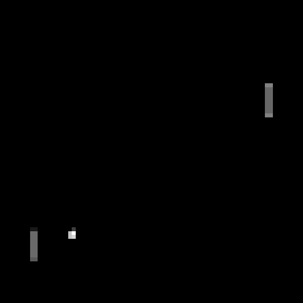
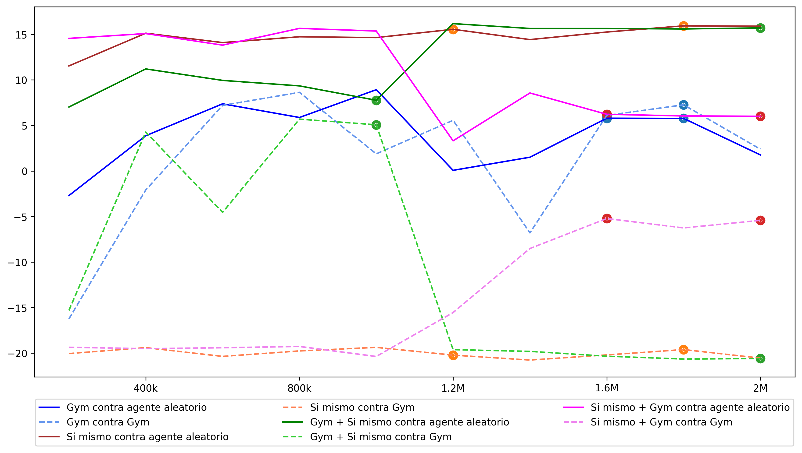

# Aprendizaje por Refuerzo

Código de las implementaciones del trabajo de fin de máster *Aprendizaje por Refuerzo* de Isidro Matos Bellido.

## Índice
- [Enseñando a un agente a jugar al blackjack](#blackjack)
- [Problema del taxista](#taxista)
- [Enseñando a un agente a jugar al Pong](#atari)

## Enseñando a un agente a jugar al blackjack 

Archivo `blakcjack.ipynb`.

Nuestro objetivo será enseñar a un agente a jugar al blackjack mediante un método de Monte Carlo para políticas $\varepsilon$-suaves. Usaremos la implementación de OpenAI Gym para generar las partidas de blackjack, esta interfaz muestra los estados como puede observarse en la imagen a continuación.

  

  
Aplicamos el método de Monte Carlo para políticas $\varepsilon$-suaves, tomando como política inicial la política aleatoria e imponiendo como condición de parada que cada uno de los 560 pares estado-acción sea visitado, al menos, 1000 veces. Tras entorno a 50 minutps de cálculo y unas 45 millones de partidas obtenemos la siguiente política óptima:

<table><tr>
  <td> 
  
 </td>
  <td> 
  
 </td>
</tr></table>

Los valores en azul son aquellos en los que la política que hemos obtenido no coincide con la planteada por Richard S. Sutton y Andrew G. Barto en Reinforcement Learning, esta diferencia no es muy significativa pues la función de valor en estos dos pares estado-acción varía en el tercer decimal, ambas acciones (*hit* y *stick*) tienen una recompensa esperada muy similar.

## Problema del taxista 

Archivo `taxista.ipynb`.

El problema del taxista consiste en entrenar a un agente, que vive en un tablero de 5x5, para que sea capaz de recoger a un cliente y llevarlo a su destino. Al igual que antes usamos la interfaz facilitada por OpenAI Gym para generar los distintos episodios del entrenamiento. Un estado inicial obtenido de esta forma puede observarse a continuación.

  

 En este caso entrenaremos dos agentes y los compararemos, uno de ellos seguirá el algoritmo Sarsa mientras que el otro seguirá el algoritmo de $Q$-*learning*. El entrenamiento de ambos se hará usando los mismos estados iniciales para asegurarnos de que la comparación es lo más realista posible. Pararemos el entrenamiento de ambos tras un número fijo de episodios, como es un ejemplo sencillo lo fijaremos como 5000, con este número tardaremos unos 10 segundos en entrenar a ambos agentes.

 Tras el entrenamiento se obtiene que ambos agentes obtienen una recompensa media en sus mejores 100 episodios (seguidos) de más de 8.5 en la inmensa mayoría de las ejecuciones, estos resultados pueden considerarse bastante buenos siguiendo la [clasificación](https://github.com/openai/gym/wiki/Leaderboard) facilitada en el repositorio de GitHub de OpenAI Gym.

 La comparativa entre las recompensas medias para ambos algoritmos puede observarse en la imagen a continuación, como puede verse ambos agentes tienen un rendimiento bastante parecido.

 
  

 Además de esta comparativa, para comprobar realmente el entrenamiento, se han grabado algunas de los episodios por los cuales han pasado los agentes durante el entrenamiento, estos pueden verse a través de la siguiente [lista de reproducción](https://youtube.com/playlist?list=PLzjBjc6HHLwhhE-Pdzvxjl0eR0Ah9mSr8) de YouTube.

 ## Enseñando a un agente a jugar al Pong 
 
 Carpeta `atari`.
 
Enseñaremos a un agente a jugar al conocido juego de la Atari 2600 Pong haciendo uso de $Q$-*learning* profundo. En concreto, entrenaremos cuatro agentes distintos mezclando entrenamiento contra el agente incorporado por OpenAI Gym y entrnamiento multiagente en el que el agente entrenará contra si mismo, para ello usaremos la API de PettingZoo.

En el juego Pong hay dos paletas, una verde (que aparece a la derecha de la pantalla) y una naranja (izquierda de la pantalla), el objetivo de cada una de ellas es conseguir que la bola pase por detrás de su rival, de esta forma ganará un punto. Las partidas de Pong acaban cuando uno de los jugadores consigue 21 puntos. Este juego cuenta con 6 acciones distintas NOOP (0), FIRE (1), RIGHT (2), LEFT (3), RIGHTFIRE (4) y LEFTFIRE (5). 

Para simular a la Atari 2600 usaremos [ALE](https://github.com/mgbellemare/Arcade-Learning-Environment), en la implementación del Pong la pantalla tiene un tamaño de 210$\times$160 píxeles, cada uno de ellos con 128 colores disponibles, por lo que tendremos un total de $128^{210*160} \approx 10^{70802}$. Por contar con una cantidad de estados tan grande realizaremos un preprocesado previo de cada estado para que el entrenamiento sea más rápido.

### Preprocesado
<table><tr>
  <td> 
  
 </td>
  <td> 
  
 </td>
  <td> 
  
 </td>
</tr></table>

Para que el entrenamiento sea mas rápido se realizarán algunas operaciones de preprocesado como son:
- **Pasar la imagen a blanco y negro junto con recortar y escalar la zona de juego.**
- **Simetría y cambio de color en el entrenamiento multiagente.**  La estructura del Pong en PettingZoo está compuesta dos jugadores (`first_0` y `second_0`) cada uno corresponde con una de las palas del Pong, la verde (derecha) y naranja (izquierda) respectivamente. Para poder conseguir que un agente juegue contra si mismo necesitamos poder usar la red que lo determina con su rival. La red que estamos entrenando ha aprendido que mueve al agente de la derecha (que es verde) y que su rival (que es naranja) se encuentra en la parte izquierda de la pantalla. Para poder usar esta red con el agente `second_0` debemos recrear esta situación, esto lo conseguimos gracias a la función `mirror_color`. Esta función es la encargada de realizar la simetría y el cambio de color necesarios para poder usar la red con el agente naranja. La definición completa de esta función puede verse en el archivo `atari.py`. Un ejemplo del uso de esta función viene a continuación (aunque realmente el cambio se hace en blanco y negro).
<table><tr>
  <td> 
  
 </td>
  <td> 
  
 </td>
</tr></table>

- **Máximo entre las dos últimas observaciones.**
- **Selección de acciones cada cuatro frames.**
- **Uso de _sticky actions_.**
- **Apilamiento de observaciones.**
- **Reordenamos para que tenga forma (4,80,80).**
- **Normalizar las observaciones.**

### Arquitectura de la red
Esta compuesta por una capa convolucional con 32 filtros con núcleo 8$\times$8 y paso 4, una segunda capa de convolución con 64 filtros de núcleo 4$\times$4 y paso 2, una última capa convolucional con 64 filtros con núcleo de tamaño 3$\times$3 y paso 1 y, finalmente, dos capas totalmente conectadas con una capa oculta de 512 neuronas, todas separadas entre si por una ReLU. Esta red está definida en el archivo `dqn.py`.

### Entrenamiento
Como se ha comentado realizaremos cuaatro tipos de entrenamiento. En el primero entrenaremos al agente solo contra el agente implementado en OpenAI Gym, el segundo de ellos se realizará con el agente jugando solo contra si mismo, y los otros dos restantes serán las dos posibles combinaciones de los anteriores. Todos los entrenamientos se realizarán durante dos millones de _frames_.

Los resultados intermedios obtenidos durante el entrenamiento son:
| Tipo de entrenamiento | Duración | Partidas jugadas | Mejor recompensa | Número rivales |
| --------------------- | -------- | ---------------- | ---------------- | -------------- |
| Contra OpenAI Gym     | 3h 15min | 894              | 10.21            |                |
| Contra si mismo       | 5h 15min | 1042             |                  | 88             |
| Contra Gym + Si mismo | 4h 20min | 987              | 10.01            | 47             |
| Contra Si Mismo + Gym | 4h 20min | 942              | -0.99            | 45             |

### Resultados obtenidos
El análisis de los resultados se hará en dos etapas. 

#### Primera etapa
En la primera se ha hecho juagr a cada uno de los agentes, y sus copias de seguridad (realizadas cada 200k _frames_), 100 contra el agente de OpenAI Gym y contra el agente alatorio, los mejores agentes se seleccionan para la siguiente etapa.

  

La gráfica resume la recompensa obtenida por los agentes al jugar contra ambos agentes. Los puntos en la gráfica hacen referencia a los modelos que se seleccionarán para la seguiente etápa del análisis de resultados.

#### Segunda etapa
En la siguiente etapa se tomarán los agentes anteriores y se hará que jueguen entre ellos 100 partidas para ver cuales actúan mejor. De esta forma se han obtenido los siguientes resultados:

 
  

Como podemos ver los agentes que terminan jugando contra si mismos parecen ser los que mejor rendimiento tienen. En la siguiente [lista de reproducción](https://youtube.com/playlist?list=PLzjBjc6HHLwhvjK_h7uqNCnI3O_q5F-oK) de YouTube se puede ver una partida entre cada uno de los agentes. El nombre del video menciona primero al agente `first_0` (el verde) y después a `second_0` (el naranja).

### Uso de _sticky actions_
Las dos grandes inclusiones que se han hecho en este trabajo han sido el entrenamiento multiagente e híbrido y el uso de _sticky actions_. Para evaluar el impacto del uso de estas últimas hemos entrenado a un agente sin hacer uso de las _sticky actions_ y hemos hecho que juegue 100 partidas en las condiciones anteriores contra los agentes anteriores, sin el uso de _sticky actions_ en las partidas. 

En la siguiente tabla se puede ver que los agentes entrenados con _sticky actions_ juegan bastante mejor que el que no hace uso de estas.

 
  

